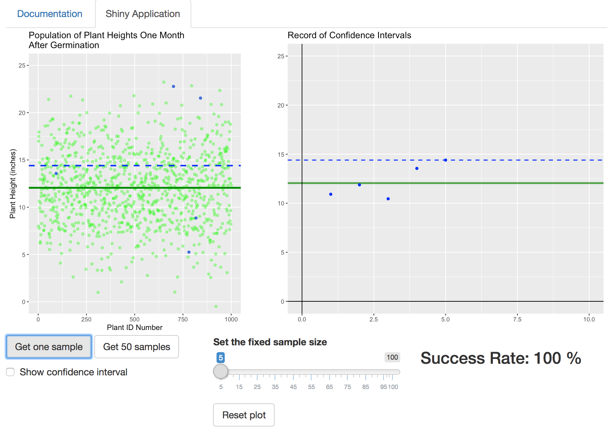

Week 4 Reproducible Pitch for Shiny App
========================================================
author: Phil Lombardo
date: 7/28/2020
autosize: true


Confidence Intervals
========================================================
incremental: true

- Important topic from Johns Hopkins [*Statistical Inference Course*](https://www.coursera.org/learn/statistical-inference/home/welcome)

- An interval predicting where population mean $\mu$ falls based on a random sample

- Uses the *t*-distribution

Example:

```r
t.test(mtcars$mpg)$conf.int
```

```
[1] 17.91768 22.26357
attr(,"conf.level")
[1] 0.95
```


Difficult Ideas to Grasp
========================================================
incremental: true

**Key Idea:**
- The confidence interval depends on the random sample
    - Different samples lead to different confidence intervals


    - Taking five different random samples from the `diamonds` data set, we get these different confidence intervals:

```r
t(sapply(1:5, function(x){
    t.test(sample(diamonds$price,50))$conf.int
}))
```

```
         [,1]     [,2]
[1,] 3494.934 6490.226
[2,] 2690.167 4569.353
[3,] 2787.141 5007.499
[4,] 2640.253 5241.387
[5,] 3426.372 5783.548
```


Difficult Ideas to Grasp
========================================================
incremental: true

**Key Idea:**

- The confidence level of a confidence interval is a success rate *for the process*
    - Take 10,000 confidence intervals made from 10,000 random samples
        - Confidence level is approximately the precentage of those confidence intervals that contain $\mu$
        
- ***How can we visualize these ideas?***


Confidence Interval Visualizing Shiny App
========================================================


[https://lombardo.shinyapps.io/Week4Project/](https://lombardo.shinyapps.io/Week4Project/)
